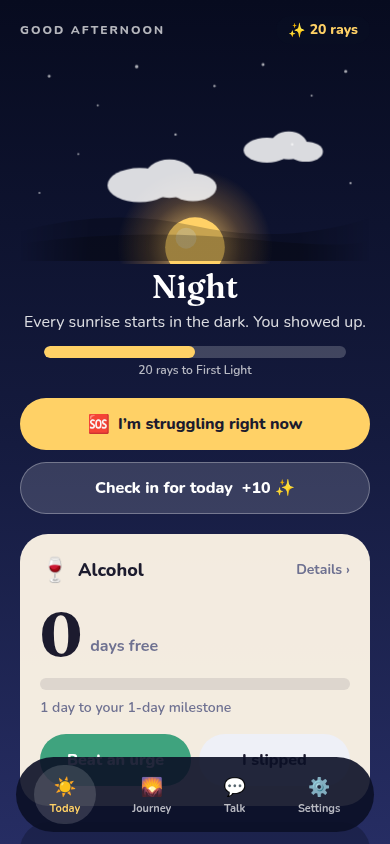
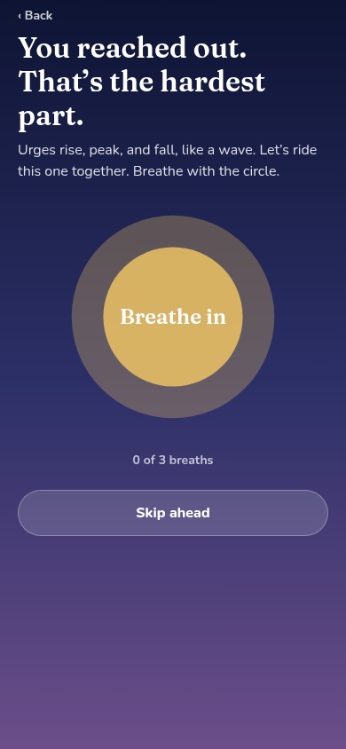
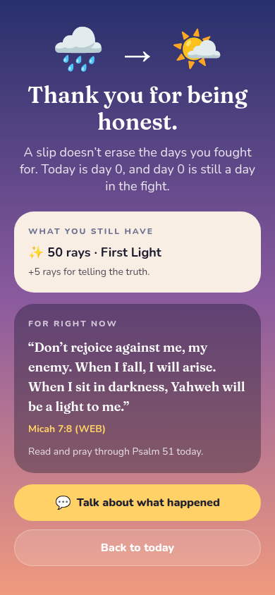
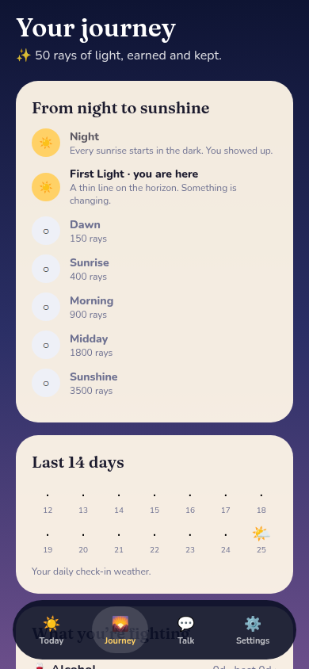

# ☀️ One More Day

**A free, private, open-source companion for anyone fighting an addiction: drink, drugs, porn, gambling, scrolling, sugar, anything.**
One day at a time, with an AI sponsor rooted in scripture, and light that never goes out.

<p>
  
  
  
  
</p>

> **Not medical care.** In danger right now? Call your local emergency number. US: call or text **988**, or SAMHSA's free helpline **1-800-662-4357** ([samhsa.gov](https://www.samhsa.gov/find-help/national-helpline)).

## Why this exists

The popular recovery apps put backups, extra trackers and support behind subscriptions of $40–$100 a year. Some recovery startups have shared users' health data with advertisers. Most of them wipe your progress to zero when you slip. Sources and details: [docs/competitive-analysis.md](docs/competitive-analysis.md).

One More Day is the opposite: **free forever, no account, no ads, no trackers, and your data stays on your device.**

## What it does

- **Track anything.** Unlimited trackers. Presets or your own words. Not sure it's a problem? *Observe mode* just shows how often.
- **"I'm struggling" button.** Breathing, your own reasons, ideas that fit your hobbies, a verse, and your AI sponsor.
- **Slips without shame.** Log before or after. Honesty earns light. Your best run and lifetime light stay on screen.
- **Sunshine.** Rays of light for check-ins, beaten urges and honesty. Seven levels from Night to Sunshine, and the sky brightens with you. [How it works](docs/sunshine.md).
- **AI sponsor.** Warm, brief, never preachy. Picks a Bible verse for what you're going through, from verses the app provides, so it can't misquote. Suggests a chapter to pray through.
- **Sees hard times coming.** Learns which days and times are hardest, and checks in before them (phone app).
- **Milestones that don't invite relapse.** Banked "break time" is shown as proof you don't need it, with an overdose warning for substances.
- **Risky places.** Optional alerts when you get near a place you marked (phone app; location never leaves the phone).
- **Daily reminder** in Google Calendar, without signing in to Google.
- **Free backup, restore and delete-everything.**

## Deploy your own (one click)

[](https://vercel.com/new/clone?repository-url=https%3A%2F%2Fgithub.com%2FDharkstranger%2Fone-more-day-&project-name=one-more-day&env=ANTHROPIC_API_KEY&envDescription=Anthropic%20API%20key%20for%20the%20AI%20sponsor%20(optional%3B%20the%20app%20works%20without%20it))

Add `ANTHROPIC_API_KEY` to turn on the AI sponsor. Everything else works without it. Full guide: [docs/self-hosting.md](docs/self-hosting.md).

## Run it locally

```bash
npm install
npx expo start --web      # or: npx expo run:ios / run:android
npm run typecheck
npm test
```

## Documentation

Everything is documented in [docs/](docs/README.md): architecture, privacy, safety rules, the API, the data format, how to add addictions, verses, languages and crisis numbers, the user lifecycle, and the design for the upcoming community feature.

## Built with

Expo (iOS, Android, web) · Expo Router · NativeWind · SQLite on-device (WebAssembly in browsers) · Claude API through a stateless relay · World English Bible (public domain, [ebible.org/web](https://ebible.org/web/)).

## License

[AGPL-3.0-or-later](LICENSE). Use it, change it, run it. If you run a changed version for others, publish your changes, so no one can quietly turn it into a paywalled or data-selling app.

Contributions welcome: [CONTRIBUTING.md](CONTRIBUTING.md).
